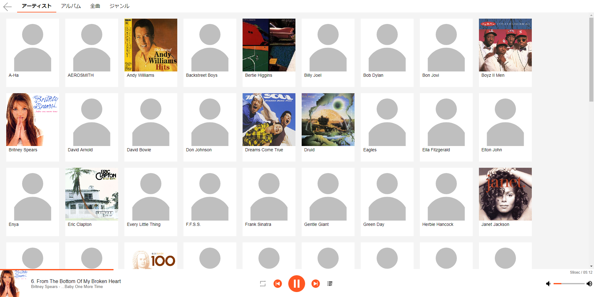
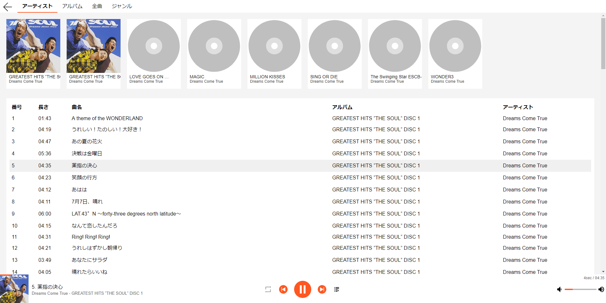
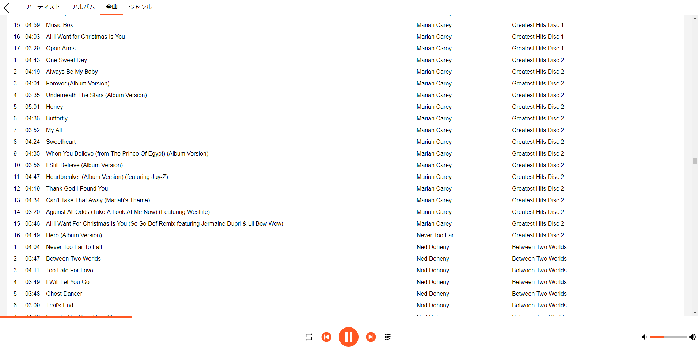
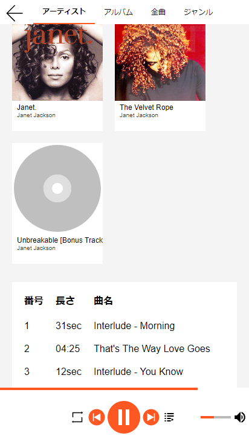
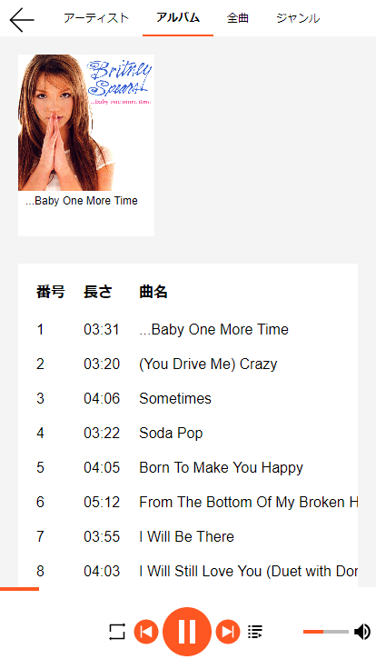
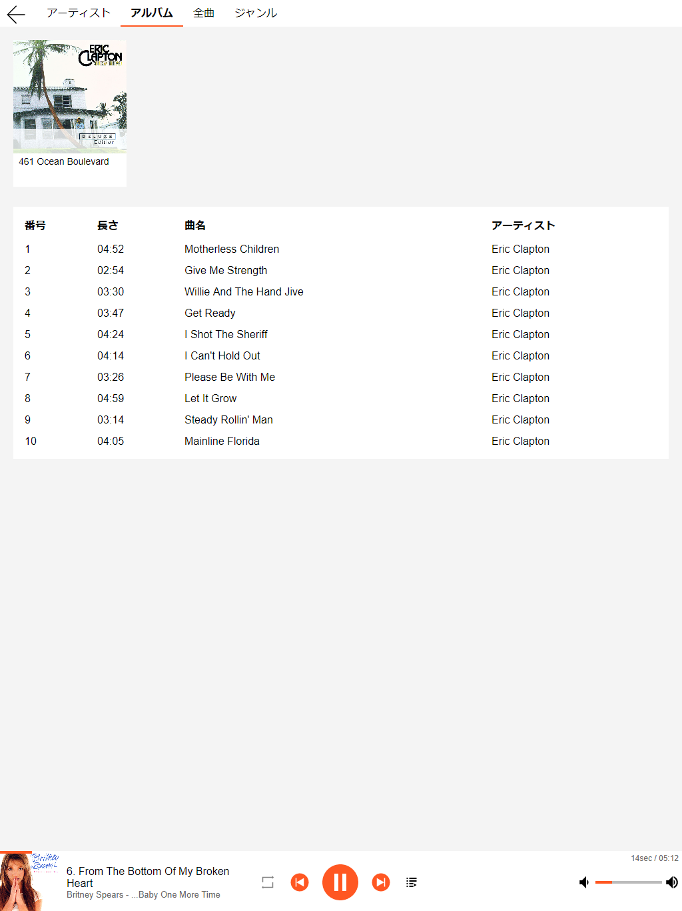

# musicServerCgi
cgiで作った音楽サーバーです。  
ブラウザが非対応な形式でもトランスコードで配信します。  
イントラサーバーとしての利用を想定しています。

## Demo
[Demo](https://kurema.github.io/musicServerCgi/)

* gh-pagesブランチを参照すれば静的ページでも利用できます。
* github pagesでこれを使って音楽を公開するってのも手です。
* Demoは必ずしも最新版とは限りません。

## スクリーンショット

Vivaldiのキャプチャを使っているのでシャドウが消えています。  
色を変えたい場合はsvg画像も変更が必要です。

## Translate
To switch to English UI,  go "設定" page, configure and reload.

You can set dafault language by changing ``var DefaultLanguage="ja";`` line.

Other languages can be supported by adding another translations.

cf.

| Japanese | English |
|:---------|:--------|
|アーティスト|artist|
|アルバム|album|
|全曲|all songs|
|ジャンル|genre|
|番号|number|
|長さ|length|
|曲名|title of the song|
|検索結果|search result|

## 使い方
1. 適当なサーバー(Linuxを想定)にApache,ffmpeg,perlをセットアップする。
2. いくつか必要なpmをcpanから入れる。
3. 音楽ファイルも入れる。場所は読み込み権限がある場所ならどこでもいい。
4. musicフォルダ内のファイルをcgiが実行できる場所に配置する。
5. music/music.confを書き換える。
6. music/.htacessも適当に書き替える。
7. ``perl refresh.pl``を初回実行。crontabに登録。

## 特長
Perl+HTML5+JavaScriptで作りました。  
restful風apiからデータを取得して、UI周りはJavaScriptでやっています。  
jQueryやらは使わない純然たるJSなので10年くらいたってもノーメンテで動くと思います。  
非対応形式はサーバー側がffmpegでトランスコードして、その場合はシークもサーバー側でやっています。  
レスポンシブデザインにも対応していてスマホでもそれなりに見えます。

なんとなくsqliteを使っていますが、MySQLを使いたい人は割と簡単に書き換えられるはずです。

## api
レスポンスはJSONのみです。  
restful風ですが普通にcgiです。

### api.cgi

| URL | 内容 |
|:----|:-----|
|api.cgi/song/|全曲取得|
|api.cgi/song/1|IDが1の曲を取得|
|api.cgi/song/album/1|アルバムIDが1の曲を取得|
|api.cgi/album/|全アルバム取得|
|api.cgi/album/1|IDが1のアルバムを取得|
|api.cgi/album/artist/1|アーティストIDが1のアルバムを取得|
|api.cgi/artist|全アーティストを取得|
|api.cgi/artist/1|IDが1のアーティストを取得|

index.htmlは起動時に全データを取得しています。  
``ArtistID``と``AlbumId``で大文字小文字が混在してしまっています。そのうち直します。

### music.cgi

| URL | 内容 |
|:----|:-----|
|music/music.cgi?id=1|ID1の曲をフォーマット変換せず取得|
|music/music.cgi?id=1&f=wav|ffmpegでwav形式に変換して取得|
|music/music.cgi?id=1&f=wav&from=10.0|wav形式で先頭から10秒以降を取得|

フォーマット変換は現状wav/mp3/oggに対応しています(m4aは挙動がおかしい。)  
index.htmlはトランスコードはデフォルトでwavが最優先なので帯域が細い場合にはいくらか変更が必要です。

### thumb.cgi
アルバムサムネイル取得の為のapiです。  
ID3タグなどは見ておらず、フォルダ内で一番軽い画像を返しているだけです。  
思いもよらない画像が返ってくることもあり得ます。  
画像がなければ404、idが不当なら500を返します。  
エラーがたくさん出ないようにapi.cgi/albumでのサムネイル有無情報を参照してください。

| URL | 内容 |
|:----|:-----|
|music/thumb.cgi?id=1|id1のアルバムフォルダに含まれる最も軽量な画像を取得|

### refresh.pl
タグ情報を取得する為にファイル更新毎に実行が必要です。  
取得にはffprobeを使っています。  
crontabに登録しておくか、適宜実行しましょう。

## 代替
| ソフト | 内容|
|:--|:--|
|miniDLNA|DLNAでは定番です。 対応アプリも多いのでネイティブアプリ・ソフトを使いたいならこちら。 自分の環境だとちょっと動作がおかしいです。|
|Music apps.ownCloud.com|私が最初に検討したのがこれです。ただ何となくownCloudが嫌なのでやめました。|
|Google Play Music|外出先で使うならこれ一択です。 自分のコレクションだけなら無料で(一旦クレカ登録が必要)どこからでも聞けます。|
